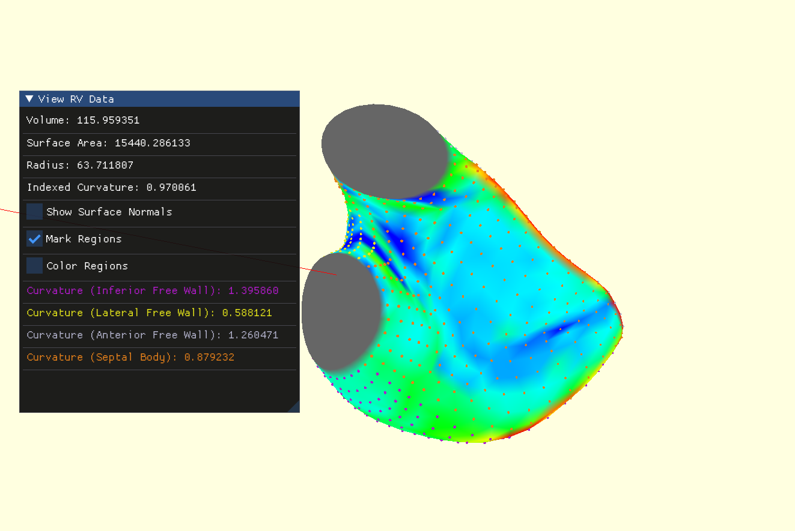

# Right Ventricle Analysis 

This repository contains code to extract curvature, volume, area, and directional strain from 3D mesh data obtained with echocardiography. 

GUI is built using OpenGL and one can analyse one mesh at a time using the GUI. Batch analysis for multiple cycles is possible using the calculation functionalities of the repository. This works with 3D mesh data created with TomTec. 

### Curvature comparison

### GUI for analysis 

