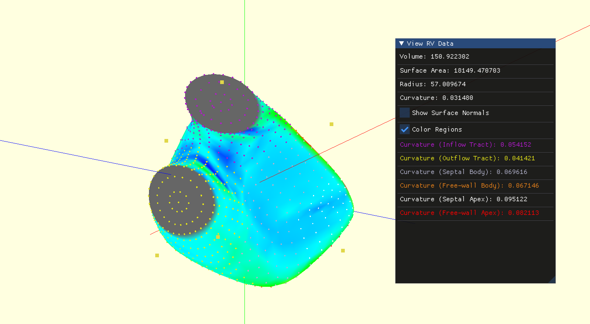

# Code for RV Data 

Output data of data can be found in the directory `output-data`

<!-- Notes: 
- Version name is in in the title of the `*.txt` file. It is simply the data. 
    If there are multiple versions per day. It will be `beutel-data-[data]-[n].txt`
- Timestamps -> Not sure how they can be incorporated. Header file and number of beutels don't match. 
- Which warnings/successes?
- Indexed curvature can be parameterised to use different methods.  -->